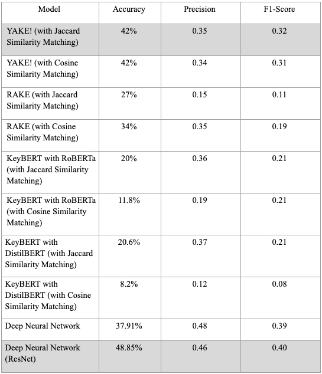
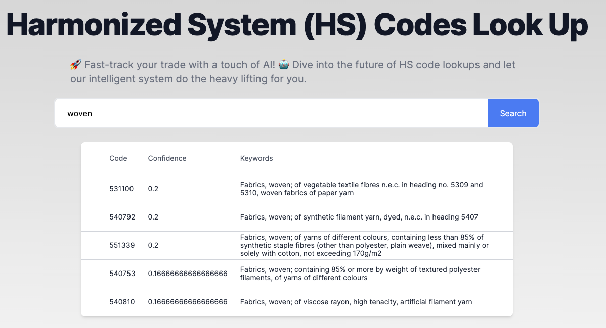

# Harmonized Commodity Code Prediction

Description
-----------
Harmonized Tariff Schedule (HS-Code) codes provide a systematic structure for the classification and taxation of products. Customs experts assign HS codes to tens of thousands of products every day. This manual process of assigning codes is a time-consuming, tiresome, and error-prone task. 

we crawled numerous US Imports data from the US Imports website  https://usimports.info/, we are using multiple models including **YAKE, RAKE, KeyBERT, ResNet** for HS-code prediction.

Try it out
-----------
Try our lookup through web: https://hs-code-nextjs.vercel.app/

We will migrate our service to a better place soon.

Frontend (Next.js React) Github Repo: https://github.com/hyqshr/HS_Code_Nextjs

Authors
-----------
[Priyanka Padinam](https://github.com/priya1118), [Santosh Saranyan](https://github.com/santoshsaranyan) , [Hwijong Im](https://github.com/bellwood22), [Yiqiu Huang](https://github.com/hyqshr)
