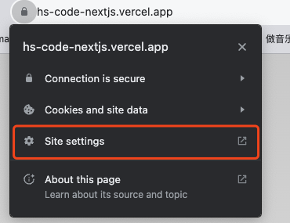
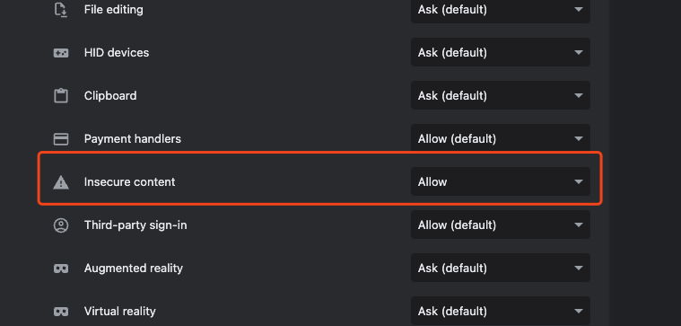

# Harmonized Commodity Code Prediction

Description
-----------
Harmonized Tariff Schedule (HTS) codes provide a systematic structure for the classification and taxation of products, enabling International trade worldwide. Customs experts assign HS codes to tens of thousands of products every day. This manual process of assigning codes is a time-consuming, tiresome, and error-prone task. So, we want to automate this process leveraging machine learning to reduce errors in the classification process and reduce manual effort. 
To build this machine learning model, we are using 2021 updated US Imports data from the US Imports website  https://usimports.info/ , from where we crawled numerous product descriptions for each HS code. We are using YAKE, RAKE, and KeyBERT models to extract keywords from the data, which will be matched with the new product descriptions using Fuzzy String Matching to assign HS codes to new products. We will find the best-performing model using metrics such as accuracy, precision, recall, and F1 score. 

Try it out
-----------
Try our lookup through web: https://hs-code-nextjs.vercel.app/

Currently we host our service on EC2 free tier which does not offer SSL by natural, so you will need to `allow insecure content` in the following tab:

We will migrate our service to a better place soon.

Frontend (Next.js React) Github Repo: https://github.com/hyqshr/HS_Code_Nextjs

Authors
-----------
Priyanka Padinam, Santosh Saranyan , Hwijong Im, Yiqiu Huang
